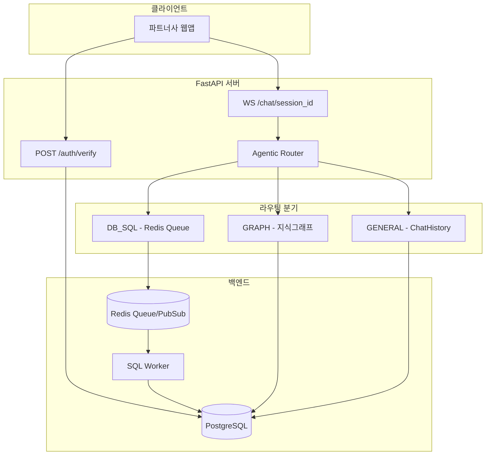

# Palantiny 챗봇 서버 구현 계획

## 아키텍처 개요




---

## 1. 프로젝트 구조 및 환경 설정

### 디렉토리 구조

```
server2/
├── app/
│   ├── __init__.py
│   ├── main.py                 # FastAPI 앱 진입점
│   ├── api/
│   │   ├── __init__.py
│   │   ├── v1/
│   │   │   ├── __init__.py
│   │   │   ├── auth.py         # POST /auth/verify
│   │   │   └── chat.py         # WS /chat/{session_id}
│   │   └── deps.py             # 공통 의존성
│   ├── core/
│   │   ├── __init__.py
│   │   ├── config.py           # Pydantic Settings
│   │   └── security.py         # 토큰 검증 헬퍼
│   ├── models/
│   │   ├── __init__.py
│   │   ├── user.py
│   │   ├── chat_history.py
│   │   ├── herb_master.py
│   │   └── inventory.py
│   ├── services/
│   │   ├── __init__.py
│   │   ├── llm_router.py       # 의도 분석 및 라우팅
│   │   ├── chat_service.py     # 채팅 로직, Redis Queue Producer
│   │   ├── graph_service.py    # 한약재 지식 그래프 Mock
│   │   └── sql_worker.py       # Redis BLPOP Consumer
│   └── utils/
│       ├── __init__.py
│       ├── prompts.py          # 라우팅/생성용 프롬프트
│       └── helpers.py          # session_id 생성 등
├── docker-compose.yml
├── Dockerfile
├── requirements.txt
├── alembic.ini                 # DB 마이그레이션 (선택)
└── .env.example
```

### 핵심 의존성 (requirements.txt)

- `fastapi`, `uvicorn[standard]`, `websockets`
- `sqlalchemy[asyncio]`, `asyncpg` (PostgreSQL 비동기)
- `redis`, `aioredis` 또는 `redis` (4.x+ async 지원)
- `pydantic-settings`, `python-dotenv`
- `openai` (선택, Mock 모드 대비)
- `langchain` (선택, 라우팅 강화 시)

---

## 2. 데이터베이스 스키마 (SQLAlchemy)

### 모델 정의 위치: `app/models/`


| 모델              | 주요 필드                                                                          | 비고        |
| --------------- | ------------------------------------------------------------------------------ | --------- |
| **User**        | `user_id` (PK), `partner_token` (unique), `role`, `created_at`                 | 파트너사별 사용자 |
| **ChatHistory** | `id` (PK), `session_id` (인덱스), `user_id` (FK), `role`, `content`, `created_at` | 대화 기록     |
| **HerbMaster**  | `herb_id` (PK), `name`, `origin`, `efficacy`                                   | 한약재 기본 정보 |
| **Inventory**   | `inventory_id` (PK), `herb_id` (FK), `partner_id`, `stock_quantity`, `price`   | 재고/단가     |


- `app/models/__init__.py`에서 `Base.metadata` 및 모든 모델 export
- `app/core/config.py`의 `DATABASE_URL`로 비동기 엔진 생성
- `async_sessionmaker`로 세션 팩토리 구성

---

## 3. 인증 API: `POST /api/v1/auth/verify`

**파일**: [app/api/v1/auth.py](app/api/v1/auth.py)

**요청**: `{"partner_token": "string"}`

**처리 흐름**:

1. `partner_token`으로 User 테이블 조회
2. 없으면 401 Unauthorized
3. `user_id`로 ChatHistory에서 최근 N건 조회 (예: 최근 10턴)
4. `session_id` 생성: `uuid4` 또는 `f"{user_id}_{timestamp}"`
5. **응답**: `{"session_id": "...", "user_id": "...", "recent_history": [...]}`

---

## 4. WebSocket 채팅 및 Agentic 라우팅

**파일**: [app/api/v1/chat.py](app/api/v1/chat.py), [app/services/chat_service.py](app/services/chat_service.py), [app/services/llm_router.py](app/services/llm_router.py)

### WebSocket 메시지 프로토콜


| type     | 용도                             |
| -------- | ------------------------------ |
| `status` | 진행 상태 (의도 분석, 그래프 탐색, DB 조회 등) |
| `token`  | 스트리밍 토큰 (한 글자씩)                |
| `end`    | 턴 종료 신호                        |


### 라우팅 로직 (llm_router.py)

1. **의도 분석**: LLM 호출 → `route`, `reason`, `extracted_entities` JSON 반환
2. **라우트별 처리**:
  - **GRAPH**: `graph_service.py`의 Mock 딕셔너리 탐색 (한약재 효능/관계)
  - **DB_SQL**: LLM이 SQL 생성 → Redis `sql_task_queue`에 LPUSH → 결과 채널 BLPOP 대기
  - **GENERAL**: ChatHistory 기반 일상 대화

### chat_service.py 핵심 흐름

```
수신 메시지 → status(의도분석) → 라우팅 실행 → status(라우트별) → 
데이터 수집(Graph/DB/History) → LLM 최종 답변 스트리밍 → end → ChatHistory 저장
```

---

## 5. Redis Queue 및 SQL Worker

### Producer (chat_service.py)

- `DB_SQL` 라우팅 시:
  1. LLM으로 Text-to-SQL 생성
  2. `task_id = uuid4()` 생성
  3. `LPUSH sql_task_queue {task_id, sql, result_key}`
  4. `BLPOP result_key` (타임아웃 30초)로 결과 대기
  5. 결과를 LLM 컨텍스트에 포함

### Consumer (sql_worker.py)

- 별도 프로세스 또는 `asyncio.create_task` 백그라운드 루프
- `BRPOP sql_task_queue` (블로킹)
- SQL 실행 (asyncpg 또는 SQLAlchemy async)
- `RPUSH result_key {result_json}`

**Redis 키 설계**:

- Queue: `sql_task_queue`
- 결과: `sql_result:{task_id}` (List, TTL 60초)

---

## 6. Mock 및 환경 전환

### LLM Mock (llm_router.py, chat_service.py)

```python
# config: USE_MOCK_LLM = True 시
if settings.USE_MOCK_LLM or not settings.OPENAI_API_KEY:
    await asyncio.sleep(0.5)  # 지연 시뮬레이션
    return {"route": "GENERAL", "reason": "Mock", "extracted_entities": {}}
```

### Graph Mock (graph_service.py)

```python
HERB_ONTOLOGY = {
    "감초": {"efficacy": "보익기", "related": ["대추", "생강"], "origin": "중국"},
    "대추": {"efficacy": "보혈안신", "related": ["감초"], "origin": "한국"},
    # ...
}
```

---

## 7. Docker Compose

**서비스**:

- `app`: FastAPI (uvicorn)
- `postgres`: PostgreSQL 15
- `redis`: Redis 7
- `sql_worker`: SQL Worker (별도 컨테이너 또는 app 내 백그라운드 태스크)

---

## 8. 구현 순서 (권장)

1. **환경 세팅**: requirements.txt, .env.example, docker-compose.yml, Dockerfile
2. **Core**: config.py, security.py, DB 연결
3. **Models**: User, ChatHistory, HerbMaster, Inventory
4. **Auth API**: POST /api/v1/auth/verify
5. **Utils**: prompts.py, helpers.py (session_id 등)
6. **Services**: graph_service (Mock), llm_router (의도 분석 + Mock)
7. **Redis + SQL Worker**: sql_worker.py, chat_service의 Producer 로직
8. **Chat Service**: 전체 채팅 플로우 (라우팅 → 데이터 수집 → 스트리밍 → 저장)
9. **WebSocket API**: WS /api/v1/chat/{session_id}
10. **통합 테스트**: 시드 데이터, API/WS 수동 검증

---

## 9. 주요 파일별 구현 포인트


| 파일                | 핵심 내용                                                          |
| ----------------- | -------------------------------------------------------------- |
| `main.py`         | FastAPI 앱, 라우터 등록, lifespan에서 DB/Redis 연결 및 Worker 시작          |
| `config.py`       | `OPENAI_API_KEY`, `USE_MOCK_LLM`, `REDIS_URL`, `DATABASE_URL`  |
| `auth.py`         | `verify_partner_token`, User 조회, ChatHistory 로드, session_id 반환 |
| `chat.py`         | WebSocket 수락, `chat_service.process_message()` 호출, 메시지 전송      |
| `llm_router.py`   | 의도 분석 LLM 호출, JSON 파싱, Mock 분기                                 |
| `chat_service.py` | 라우팅 실행, Graph/DB/History 데이터 수집, 스트리밍, ChatHistory 저장          |
| `sql_worker.py`   | BRPOP 루프, SQL 실행, RPUSH 결과, 예외 처리                              |


---

## 10. 코딩 가이드라인 반영

- **비동기**: 모든 DB/Redis/LLM 호출 `async/await`
- **주석**: Redis Queue 사용 이유(DB 락 방지), 라우팅 목적(의도별 최적 경로), Mock 전환 이유(개발/테스트) 등 명시
- **에러 처리**: 401(인증 실패), 404(session 없음), 500(내부 오류) 적절히 반환

